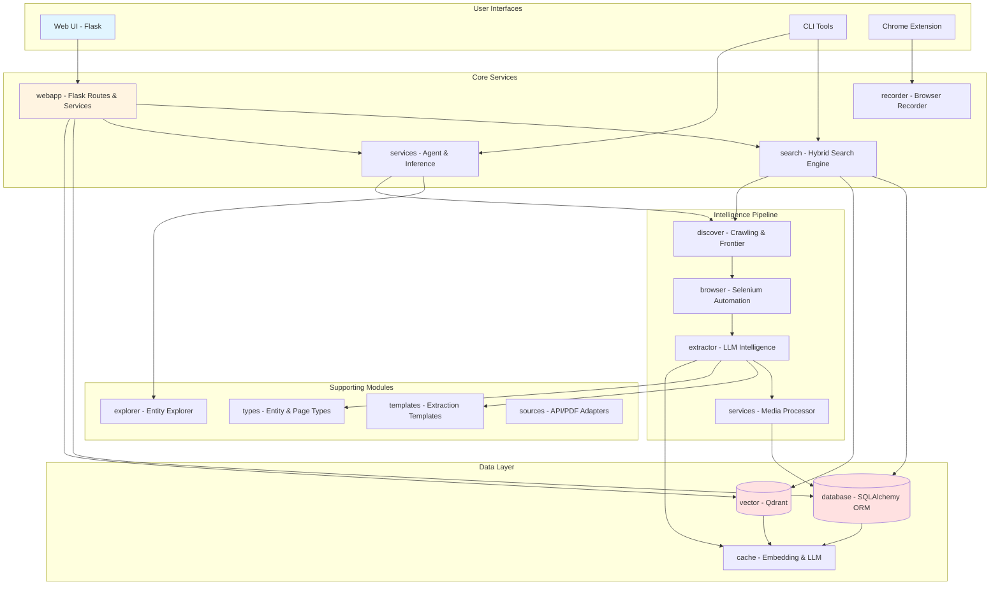
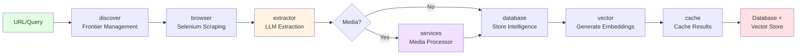

# Garuda: Entity-Aware Web Intelligence Crawler

[](LICENSE)


## Overview

**Garuda** is an advanced, entity-focused intelligence gathering and analysis platform that combines **web crawling**, **LLM-powered extraction**, **semantic search**, and **adaptive learning** to build comprehensive knowledge graphs. Named after the mythical eagle with omniscient vision, Garuda provides deep insights into entities (companies, people, organizations, products) through intelligent, gap-aware data collection.

### What Makes Garuda Different?

🧠 **Intelligent & Adaptive**: Unlike traditional crawlers, Garuda analyzes what it already knows and automatically fills knowledge gaps through targeted searches.

🔍 **RAG-First Hybrid Search**: Combines SQL keyword search with semantic vector search, with **automatic retry using paraphrased queries** and intelligent web crawling when needed.

🕸️ **Knowledge Graph**: Tracks entities, relationships, and temporal changes in a unified graph structure with full provenance.

🎬 **Multi-Modal Processing**: Extracts intelligence from text, images (OCR), videos (transcription), and audio files.

🔧 **Production-Ready**: Web UI with 15 specialized panels, REST API, Chrome extension, and comprehensive CLI tools.

### Primary Use Cases

- **Open Source Intelligence (OSINT)**: Gather structured intelligence on companies, individuals, infrastructure
- **Corporate Research**: Build entity profiles with automated gap analysis and competitive intelligence
- **Threat Intelligence**: Track actors, infrastructure, tactics from public sources
- **Academic Research**: Create domain-specific knowledge graphs from scholarly and news sources
- **Brand Monitoring**: Monitor mentions, sentiment, and relationships across the web

---

## Table of Contents

- [Key Features](#key-features)
- [Architecture Overview](#architecture-overview)
  - [System Architecture](#system-architecture)
  - [Processing Pipeline](#processing-pipeline)
  - [RAG Hybrid Search with Retry](#rag-hybrid-search-with-retry)
  - [Data Model](#data-model)
- [Module Organization](#module-organization)
- [Key Technologies](#key-technologies)
- [Requirements](#requirements)
- [Installation](#installation)
  - [Method 1: Git Clone + Pip Install](#method-1-git-clone--pip-install)
  - [Method 2: Docker Compose](#method-2-docker-compose)
- [Configuration](#configuration)
  - [Complete Environment Variables Reference](#complete-environment-variables-reference)
- [Docker](#docker)
  - [Services](#services)
  - [GPU Support](#gpu-support)
  - [Data Volumes](#data-volumes)
- [CLI Tools](#cli-tools)
- [Quickstart](#quickstart)
  - [Using Docker](#using-docker)
  - [Using Local Installation](#using-local-installation)
- [RAG Retry with Paraphrasing](#rag-retry-with-paraphrasing)
  - [4-Phase Intelligent Search](#4-phase-intelligent-search)
  - [Configuration](#rag-configuration)
  - [API Response Fields](#api-response-fields)
  - [Performance & Benefits](#performance--benefits)
- [Screenshots](#screenshots)
- [Chrome Extension](#chrome-extension)
- [Contributing](#contributing)
- [Security Notes](#security-notes)
- [License](#license)

---

## Key Features

### Web UI - 15 Specialized Panels

Modern Flask-based interface with comprehensive tabs:

- 🤖 **Agent Panel**: Autonomous entity exploration and gap filling
- 💬 **Chat**: RAG-powered conversational search with 4-phase intelligent retry
- 🌐 **Crawl**: Intelligent web crawling with entity-awareness
- 📊 **Data Quality**: Entity completeness analysis and data quality metrics
- 🕸️ **Entities Graph**: Interactive relationship visualization with unique entities
- 🛠️ **Entity Tools**: Deduplication, merging, and entity management
- 🔍 **Intel**: Entity extraction results and intelligence viewer
- 🎬 **Media**: Image, video, and audio processing pipeline
- 📄 **Pages**: Browse crawled pages with metadata and fingerprints
- 📝 **Recorder Admin**: Manage recorded content and sessions
- 🔎 **Recorder Search**: Search through recorded browser content
- 🔍 **Search Unified**: Hybrid SQL + semantic vector search
- 🧠 **Semantic**: Vector search with embedding visualization
- ⚙️ **Settings**: System configuration and preferences
- 📊 **Status**: System health, statistics, and monitoring

### Core Intelligence Capabilities

- **🧠 Intelligent Gap-Aware Crawling**: Automatically analyzes entity data, identifies missing fields, and generates targeted crawl strategies
- **🎯 Entity Gap Analysis**: Identifies missing data fields with completeness scoring and prioritized recommendations
- **📊 Adaptive Learning System**: Learns from crawl results to improve future discovery strategies
- **🔄 Dynamic Entity Kind Registry**: Supports entity kind inheritance (CEO → Person), runtime registration, automatic normalization
- **👥 Related Entity Extraction**: Extracts ALL entities mentioned on a page with automatic relationship creation
- **🕸️ Complete Relationship Persistence**: Ensures ALL entity relationships are persisted, even for multi-level hierarchies
- **🔁 Configurable Chat Search Cycles**: Multiple search/crawl cycles (default 3) with early termination on success

### Advanced Media Processing

- **Image Processing**: Tesseract OCR or AI Image2Text models
- **Video Processing**: Audio transcription or AI Video2Text models
- **Audio Processing**: Speech-to-text for audio files
- **Multiple Backends**: Configurable processing methods per media type
- **Embedding Integration**: Convert media into embeddings integrated into the knowledge graph

### Additional Features

- **Chrome Extension**: Record pages/elements/images directly in-browser, with fast search and preview
- **Multi-layer Extraction**: HTML, metadata, images, fingerprints + LLM-powered intel with reflection/verification
- **Structured Storage**: SQLAlchemy ORM with support for SQLite/PostgreSQL + Qdrant vector search
- **Conversational Search**: RAG-style CLI & web chat with automatic retry and paraphrasing
- **Modular & Extensible**: Python modules organized for easy development and customization
- **Strong Security**: API-key protected endpoints, CORS configuration, local LLM/vector options

---

## Architecture Overview

### System Architecture



### Processing Pipeline



### RAG Hybrid Search with Retry

Garuda implements a **4-phase intelligent search** strategy that maximizes answer quality while minimizing unnecessary web crawling:


**Key Benefits:**
- **Higher Success Rate**: Paraphrasing captures different semantic variations
- **Better Coverage**: Increased hit count ensures more context
- **Reduced Crawling**: ~40% fewer Phase 3 triggers, avoiding expensive web crawls
- **Improved UX**: Faster responses with better answers (Phase 2 adds only ~2-4 seconds)

### Data Model


---

## Module Organization

```
Garuda/
├── .env                          # Environment config (Docker-oriented defaults)
├── Dockerfile                    # Python 3.13-slim + Chrome + ChromeDriver + Tesseract
├── docker-compose.yml            # 3 services: garuda, qdrant, ollama
├── pyproject.toml                # Package config, entry points, tools
├── requirements.txt              # Python dependencies
├── LICENSE                       # GPL-3.0
├── build/lib/                    # Build artifacts
├── media/
│   ├── screenshots/              # UI screenshots
│   └── videos/                   # Demo videos (GarudaExplained.mp4, GarudaTeaser.mp4)
├── plugin/
│   └── chrome/                   # Chrome extension
│       ├── background.js         # Service worker
│       ├── content.js            # Content script
│       ├── manifest.json         # Extension manifest
│       ├── popup.html            # Extension UI
│       └── popup.js              # Extension logic
├── tests/                        # ~30 test files
└── src/
    └── garuda_intel/
        ├── __init__.py
        ├── config.py              # Settings dataclass with from_env()
        ├── search.py              # Main search CLI entry point
        ├── browser/               # Web scraping & browser automation
        │   ├── selenium.py        # Selenium WebDriver wrapper
        │   └── active.py          # Active browser session management
        ├── cache/                 # Caching infrastructure
        │   ├── cache_manager.py   # Cache coordination
        │   ├── embedding_cache.py # Embedding cache
        │   └── llm_cache.py       # LLM response cache
        ├── database/              # ORM & persistence layer
        │   ├── models.py          # SQLAlchemy models
        │   ├── engine.py          # Database engine setup
        │   ├── store.py           # Data access layer
        │   ├── cli.py             # Database CLI (garuda-db)
        │   ├── relationship_manager.py  # Relationship persistence
        │   ├── helpers.py         # Database utilities
        │   ├── refresh.py         # Data refresh logic
        │   └── repositories/      # Repository pattern implementations
        ├── discover/              # Crawling & discovery logic
        │   ├── crawl_modes.py     # Crawl strategies
        │   ├── crawl_learner.py   # Adaptive learning
        │   ├── frontier.py        # URL frontier management
        │   ├── post_crawl_processor.py  # Post-crawl processing
        │   ├── seeds.py           # Seed URL management
        │   └── refresh.py         # Discovery refresh
        ├── docker/                # Docker CLI tool
        │   └── tool.py            # Docker management (garuda-docker)
        ├── explorer/              # Entity exploration
        │   ├── engine.py          # Exploration engine
        │   └── scorer.py          # Priority scoring
        ├── extractor/             # Intelligence extraction pipeline
        │   ├── intel_extractor.py # Main extraction orchestrator
        │   ├── llm.py             # LLM wrapper & paraphrasing
        │   ├── semantic_engine.py # Semantic processing
        │   ├── text_processor.py  # Text preprocessing
        │   ├── query_generator.py # Query generation & paraphrasing
        │   ├── content_classifier.py  # Content classification
        │   ├── content_router.py  # Content routing logic
        │   ├── entity_merger.py   # Entity deduplication & merging
        │   ├── filter.py          # Content filtering
        │   ├── iterative_refiner.py  # Iterative refinement
        │   ├── qa_validator.py    # Q&A validation
        │   ├── quality_validator.py  # Quality validation
        │   ├── schema_discovery.py  # Dynamic schema discovery
        │   ├── semantic_chunker.py  # Semantic text chunking
        │   └── strategy_selector.py  # Strategy selection
        ├── recorder/              # Browser recorder service
        │   ├── app.py             # Recorder Flask app (garuda-intel-recorder)
        │   └── ingest.py          # Content ingestion
        ├── search/                # Search engine subpackage
        │   ├── cli.py             # Search CLI logic
        │   ├── active_mode.py     # Active search mode
        │   ├── deduplication.py   # Result deduplication
        │   ├── filtering.py       # Result filtering
        │   ├── formatters.py      # Output formatters
        │   ├── handlers.py        # Search handlers
        │   ├── hydration.py       # Result hydration
        │   ├── run_crawl_api.py   # Crawl API integration
        │   ├── seed_discovery.py  # Seed discovery logic
        │   └── utils.py           # Search utilities
        ├── services/              # High-level services
        │   ├── adaptive_crawler.py  # Adaptive crawling service
        │   ├── agent_cli.py       # Agent CLI (garuda-agent)
        │   ├── agent_service.py   # Agent service logic
        │   ├── entity_gap_analyzer.py  # Gap analysis
        │   ├── inference_engine.py  # Inference engine
        │   ├── media_processor.py  # Base media processor
        │   ├── media_detector.py   # Media detection
        │   ├── media_downloader.py # Media download
        │   ├── media_extractor.py  # Media extraction
        │   ├── media_linker.py     # Media linking
        │   └── adaptive_media_processor.py  # Adaptive media processing
        ├── sources/               # Multi-source adapters
        │   ├── api_adapter.py     # API source adapter
        │   ├── base_adapter.py    # Base adapter interface
        │   └── pdf_adapter.py     # PDF source adapter
        ├── templates/             # Extraction templates
        │   ├── extraction.py      # Extraction templates
        │   └── ranking.py         # Ranking templates
        ├── types/                 # Type definitions
        │   ├── entity/
        │   │   ├── profile.py     # Entity profile types
        │   │   ├── registry.py    # Entity kind registry
        │   │   └── type.py        # Entity types
        │   └── page/
        │       └── fingerprint.py # Page fingerprinting
        ├── vector/                # Vector database integration
        │   ├── engine.py          # Vector engine
        │   └── base.py            # Base vector interface
        └── webapp/                # Flask Web Application
            ├── app.py             # Main Flask app (garuda-intel-webapp)
            ├── routes/            # 15 route blueprints
            │   ├── __init__.py
            │   ├── static.py      # Static file routes
            │   ├── recorder.py    # Recorder routes
            │   ├── search.py      # Search & chat routes
            │   ├── crawling.py    # Crawl management
            │   ├── entities.py    # Entity management
            │   ├── relationships.py  # Relationship routes
            │   ├── entity_gaps.py    # Gap analysis routes
            │   ├── entity_deduplication.py  # Deduplication routes
            │   ├── entity_relations.py  # Entity relations
            │   ├── media.py       # Media routes
            │   ├── graph_search.py  # Graph search
            │   ├── relationship_confidence.py  # Confidence routes
            │   ├── schema.py      # Schema routes
            │   └── agent.py       # Agent routes
            ├── services/          # Web services
            │   ├── event_system.py  # Event system
            │   └── graph_builder.py  # Graph builder
            ├── utils/             # Web utilities
            │   ├── helpers.py     # Helper functions
            │   └── request_helpers.py  # Request utilities
            ├── static/            # Frontend assets
            │   ├── api.js         # API client
            │   ├── app.js         # Main app logic
            │   ├── config.js      # Frontend config
            │   ├── entities-graph.js  # Graph visualization
            │   ├── graph-search.js    # Graph search UI
            │   ├── tabs.js        # Tab management
            │   └── ...            # Additional JS/CSS
            └── templates/         # Jinja2 templates
                ├── base.html      # Base template
                ├── index.html     # Main page
                └── components/    # 15 tab components
                    ├── agent-panel.html
                    ├── chat.html
                    ├── crawl.html
                    ├── data-quality.html
                    ├── entities-graph.html
                    ├── entity-tools.html
                    ├── intel.html
                    ├── media.html
                    ├── pages.html
                    ├── recorder-admin.html
                    ├── recorder-search.html
                    ├── search-unified.html
                    ├── semantic.html
                    ├── settings.html
                    └── status.html
```

---

## Key Technologies

| Category | Technology | Purpose |
|----------|-----------|---------|
| **Web Framework** | Flask + Flask-CORS | REST API and web UI |
| **ORM** | SQLAlchemy | Database abstraction (SQLite/PostgreSQL) |
| **Vector DB** | Qdrant Client | Semantic search and embeddings |
| **Browser Automation** | Selenium WebDriver | Dynamic content scraping |
| **LLM Integration** | Ollama | Local LLM inference |
| **Embeddings** | sentence-transformers | Text embedding generation |
| **Search** | ddgs (DuckDuckGo) | Web search integration |
| **Environment** | python-dotenv | Configuration management |
| **HTML Parsing** | BeautifulSoup4 | HTML content extraction |
| **Image OCR** | Pillow + pytesseract | Text extraction from images |
| **Media Processing** | SpeechRecognition, moviepy, pydub | Audio/video transcription |
| **Data Handling** | pandas | Data manipulation and analysis |
| **Container** | Docker + Docker Compose | Containerization and orchestration |

---

## Requirements

- **Python**: 3.10 or higher
- **Database**: SQLite (default) or PostgreSQL
- **Vector DB**: Qdrant (local or remote)
- **LLM** (optional): Ollama with compatible models
- **Browser**: Chrome/Chromium (for Selenium)
- **ChromeDriver**: Matching Chrome version
- **System Tools**:
  - Tesseract OCR (for image processing)
  - FFmpeg (for video/audio processing)

---

## Installation

### Method 1: Git Clone + Pip Install

```bash
# Clone the repository
git clone https://github.com/anorien90/Garuda.git
cd Garuda

# Create virtual environment (recommended)
python3 -m venv venv
source venv/bin/activate  # On Windows: venv\Scripts\activate

# Install package in editable mode
pip install -e .

# Or install from requirements.txt
pip install -r requirements.txt

# Install system dependencies
# Ubuntu/Debian:
sudo apt-get update
sudo apt-get install -y tesseract-ocr ffmpeg chromium-browser chromium-chromedriver

# macOS:
brew install tesseract ffmpeg
brew install --cask google-chrome
brew install chromedriver

# Verify installation
garuda-intel-webapp --help
garuda-search --help
```

### Method 2: Docker Compose

```bash
# Clone the repository
git clone https://github.com/anorien90/Garuda.git
cd Garuda

# Start services (without Ollama)
docker-compose up -d

# Start services with Ollama (requires --profile llm)
docker-compose --profile llm up -d

# View logs
docker-compose logs -f garuda

# Access Web UI
# Open browser to: http://localhost:8080
```

---

## Configuration

Garuda uses environment variables for all configuration. These can be set in:
- `.env` file (recommended for Docker)
- System environment variables
- Direct export in shell

### Complete Environment Variables Reference

#### Core Database & Vector Store

| Variable | Default | Description |
|----------|---------|-------------|
| `GARUDA_DB_URL` | `sqlite:////app/data/crawler.db` | Database connection URL (SQLite or PostgreSQL) |
| `GARUDA_QDRANT_URL` | (none) | Qdrant vector database URL |
| `GARUDA_QDRANT_COLLECTION` | `pages` | Qdrant collection name for vectors |

#### LLM & Embedding Models

| Variable | Default | Description |
|----------|---------|-------------|
| `GARUDA_EMBED_MODEL` | `sentence-transformers/all-MiniLM-L6-v2` | Sentence transformer embedding model |
| `GARUDA_OLLAMA_URL` | `http://localhost:11434/api/generate` | Ollama LLM API endpoint |
| `GARUDA_OLLAMA_MODEL` | `granite3.1-dense:8b` | Ollama model name (also supports `phi3:3.8b`) |

#### Web UI & API

| Variable | Default | Description |
|----------|---------|-------------|
| `GARUDA_UI_API_KEY` | (none) | API key for protected endpoints |
| `GARUDA_UI_CORS_ORIGINS` | `*` | CORS allowed origins (comma-separated) |
| `GARUDA_UI_DEBUG` | `false` | Enable Flask debug mode |

#### Media Processing

| Variable | Default | Description |
|----------|---------|-------------|
| `GARUDA_MEDIA_PROCESSING` | `true` | Enable media processing pipeline |
| `GARUDA_MEDIA_CRAWLING` | `true` | Auto-extract media during crawls |
| `GARUDA_MEDIA_EMBEDDINGS` | `true` | Generate embeddings for media content |
| `GARUDA_MEDIA_IMAGE_METHOD` | `tesseract` | Image processing: `tesseract` or `image2text` |
| `GARUDA_MEDIA_VIDEO_METHOD` | `speech` | Video processing: `speech` or `video2text` |
| `GARUDA_MEDIA_AUDIO_METHOD` | `speech` | Audio processing: `speech` |
| `GARUDA_USE_ADAPTIVE_MEDIA` | `false` | Enable adaptive media processing |
| `GARUDA_MEDIA_PREFER_SPEED` | `false` | Optimize for processing speed |
| `GARUDA_MEDIA_PREFER_QUALITY` | `true` | Optimize for extraction quality |

#### Caching

| Variable | Default | Description |
|----------|---------|-------------|
| `GARUDA_CACHE_ENABLED` | `true` | Enable caching system |
| `GARUDA_EMBEDDING_CACHE_SIZE` | `10000` | Max embedding cache entries |
| `GARUDA_LLM_CACHE_PATH` | `/app/data/llm_cache.db` | SQLite cache for LLM responses |
| `GARUDA_LLM_CACHE_TTL` | `604800` | Cache TTL in seconds (7 days) |

#### Extraction & Quality

| Variable | Default | Description |
|----------|---------|-------------|
| `GARUDA_USE_SEMANTIC_CHUNKING` | `true` | Use semantic-aware text chunking |
| `GARUDA_ENABLE_QUALITY_VALIDATION` | `true` | Enable extraction quality validation |
| `GARUDA_MIN_COMPLETENESS_SCORE` | `0.3` | Minimum entity completeness score (0-1) |
| `GARUDA_ENABLE_SCHEMA_DISCOVERY` | `true` | Enable dynamic schema discovery |
| `GARUDA_CACHE_DISCOVERED_SCHEMAS` | `true` | Cache discovered schemas |

#### Chat & RAG

| Variable | Default | Description |
|----------|---------|-------------|
| `GARUDA_CHAT_MAX_SEARCH_CYCLES` | `3` | Max search/crawl cycles per chat query |
| `GARUDA_CHAT_MAX_PAGES` | `5` | Max pages to crawl per cycle |
| `GARUDA_CHAT_USE_SELENIUM` | `false` | Use Selenium for chat-triggered crawls |
| `GARUDA_CHAT_RAG_QUALITY_THRESHOLD` | `0.7` | Minimum similarity score for quality hits |
| `GARUDA_CHAT_MIN_HIGH_QUALITY_HITS` | `2` | Min high-quality hits before retry |
| `GARUDA_CHAT_EXTRACT_RELATED_ENTITIES` | `true` | Extract related entities during chat crawls |

#### LLM Timeouts & Retries

| Variable | Default | Description |
|----------|---------|-------------|
| `GARUDA_LLM_SUMMARIZE_TIMEOUT` | `900` | Summarization timeout (15 min) |
| `GARUDA_LLM_EXTRACT_TIMEOUT` | `900` | Extraction timeout (15 min) |
| `GARUDA_LLM_REFLECT_TIMEOUT` | `300` | Reflection timeout (5 min) |
| `GARUDA_LLM_SUMMARIZE_RETRIES` | `3` | Max retries for summarization |

#### Agent Configuration

| Variable | Default | Description |
|----------|---------|-------------|
| `GARUDA_AGENT_ENABLED` | `true` | Enable agent mode |
| `GARUDA_AGENT_MAX_EXPLORATION_DEPTH` | `3` | Max relationship exploration depth |
| `GARUDA_AGENT_ENTITY_MERGE_THRESHOLD` | `0.85` | Entity similarity threshold for merging |
| `GARUDA_AGENT_PRIORITY_UNKNOWN_WEIGHT` | `0.7` | Weight for unknown fields in priority |
| `GARUDA_AGENT_PRIORITY_RELATION_WEIGHT` | `0.3` | Weight for relationship gaps in priority |

#### Autonomous Agent

| Variable | Default | Description |
|----------|---------|-------------|
| `GARUDA_AGENT_AUTONOMOUS_ENABLED` | `false` | Enable autonomous background exploration |
| `GARUDA_AGENT_AUTONOMOUS_INTERVAL` | `300` | Interval between autonomous cycles (5 min) |
| `GARUDA_AGENT_AUTONOMOUS_MAX_ENTITIES` | `10` | Max entities per autonomous cycle |
| `GARUDA_AGENT_AUTONOMOUS_PRIORITY_THRESHOLD` | `0.3` | Min priority score for exploration |
| `GARUDA_AGENT_AUTONOMOUS_MAX_DEPTH` | `3` | Max exploration depth for autonomous mode |
| `GARUDA_AGENT_AUTONOMOUS_AUTO_CRAWL` | `false` | Auto-trigger crawls in autonomous mode |
| `GARUDA_AGENT_AUTONOMOUS_MAX_PAGES` | `25` | Max pages per autonomous crawl |

#### Recorder Service

| Variable | Default | Description |
|----------|---------|-------------|
| `MARK_SERVER_DB` | `sqlite:///crawler.db` | Recorder database URL |
| `MARK_SERVER_API_KEY` | (none) | Recorder API key |
| `MARK_SERVER_HOST` | `0.0.0.0` | Recorder bind host |
| `MARK_SERVER_PORT` | `8765` | Recorder port |

### Example .env File

```bash
# Copy from project root .env
export GARUDA_DB_URL=sqlite:////app/data/crawler.db
export GARUDA_QDRANT_URL=http://garuda-qdrant:6333
export GARUDA_QDRANT_COLLECTION=pages
export GARUDA_EMBED_MODEL=sentence-transformers/all-MiniLM-L6-v2
export GARUDA_OLLAMA_URL=http://garuda-ollama:11434/api/generate
export GARUDA_OLLAMA_MODEL=phi3:3.8b
export GARUDA_UI_API_KEY=changeme-ui-key
export GARUDA_UI_CORS_ORIGINS=*
export GARUDA_UI_DEBUG=true
export GARUDA_MEDIA_PROCESSING=true
export GARUDA_MEDIA_CRAWLING=true
export GARUDA_MEDIA_EMBEDDINGS=true
export GARUDA_MEDIA_IMAGE_METHOD=tesseract
export GARUDA_MEDIA_VIDEO_METHOD=speech
export GARUDA_MEDIA_AUDIO_METHOD=speech
```

---

## Docker

### Services

The `docker-compose.yml` defines three services:

#### 1. **garuda** (Main Application)

- **Image**: Built from local `Dockerfile` (Python 3.13-slim + Chrome + ChromeDriver + Tesseract)
- **Container**: `garuda-webapp`
- **Port**: 8080 (Web UI)
- **Dependencies**: qdrant
- **Volumes**: `./data/garuda/` → `/app/data/`
- **Purpose**: Runs the Flask web application with all CLI tools available

#### 2. **qdrant** (Vector Database)

- **Image**: `qdrant/qdrant:latest`
- **Container**: `garuda-qdrant`
- **Port**: 6333 (Qdrant API)
- **Volumes**: `./data/qdrant/` → `/qdrant/storage`
- **Purpose**: Provides semantic vector search capabilities

#### 3. **ollama** (LLM Backend)

- **Image**: `ollama/ollama:latest`
- **Container**: `garuda-ollama`
- **Port**: 11434 (Ollama API)
- **Profile**: `llm` (optional, start with `--profile llm`)
- **Volumes**: `./data/ollama-llm/` → `/root/.ollama`
- **Purpose**: Local LLM inference for extraction and chat

### GPU Support

Both `garuda` and `ollama` services support NVIDIA GPU acceleration:

```yaml
deploy:
  resources:
    reservations:
      devices:
        - driver: nvidia
          count: all
          capabilities: [gpu]
```

**To disable GPU support:**
1. Remove the entire `deploy` block from `docker-compose.yml`
2. Or run without GPU drivers installed

### Data Volumes

All data is persisted in the `./data/` directory:

```
./data/
├── garuda/          # SQLite DB, LLM cache, media files
├── qdrant/          # Vector embeddings
└── ollama-llm/      # Ollama models (if using profile "llm")
```

### Docker Commands

```bash
# Start without Ollama
docker-compose up -d

# Start with Ollama
docker-compose --profile llm up -d

# View logs
docker-compose logs -f garuda
docker-compose logs -f qdrant
docker-compose logs -f ollama

# Stop services
docker-compose down

# Rebuild after code changes
docker-compose build garuda
docker-compose up -d garuda

# Access shell in container
docker exec -it garuda-webapp /bin/bash

# Run CLI tools in container
docker exec -it garuda-webapp garuda-search --help
docker exec -it garuda-webapp garuda-db --help
```

---

## CLI Tools

Garuda provides 7 CLI entry points defined in `pyproject.toml`:

### 1. **garuda-intel-webapp** (Web UI)

Start the Flask web application.

```bash
# Start web UI on port 8080 (default)
garuda-intel-webapp

# Custom port and host
garuda-intel-webapp --host 0.0.0.0 --port 5000

# Entry point
# garuda_intel.webapp.app:main
```

### 2. **garuda-intel-search** / **garuda-search** (Search CLI)

Interactive search CLI with hybrid SQL + semantic search.

```bash
# Interactive search mode
garuda-search

# Direct query
garuda-search "Microsoft headquarters location"

# Semantic search only
garuda-search --semantic "AI startups in healthcare"

# Search with max results
garuda-search --limit 10 "Python web frameworks"

# Entry point
# garuda_intel.search:main
```

### 3. **garuda-intel-recorder** (Recorder Service)

Start the browser recorder service (works with Chrome extension).

```bash
# Start recorder on default port 8765
garuda-intel-recorder

# Custom configuration
MARK_SERVER_PORT=9000 garuda-intel-recorder

# Entry point
# garuda_intel.recorder.app:main
```

### 4. **garuda-docker** (Docker Management)

Docker container and service management CLI.

```bash
# Show status of all services
garuda-docker status

# Start services
garuda-docker start

# Stop services
garuda-docker stop

# View logs
garuda-docker logs

# Entry point
# garuda_intel.docker.tool:main
```

### 5. **garuda-db** (Database CLI)

Interactive database management with CRUD operations.

```bash
# Interactive database browser
garuda-db

# Search entities
garuda-db search --entity "Microsoft"

# Show entity details
garuda-db show --id 123

# List all entities
garuda-db list --kind Company

# Delete entity
garuda-db delete --id 456

# Export data
garuda-db export --format json --output data.json

# Entry point
# garuda_intel.database.cli:main
```

### 6. **garuda-agent** (Agent CLI)

Autonomous entity exploration and gap filling agent.

```bash
# Start autonomous agent
garuda-agent start

# Explore specific entity
garuda-agent explore --entity-id 123

# Analyze gaps for entity
garuda-agent analyze --entity-id 123

# Stop autonomous agent
garuda-agent stop

# Agent status
garuda-agent status

# Entry point
# garuda_intel.services.agent_cli:main
```

### 7. **garuda-intel-web** (Alternate Web Entry)

Alternative console script for web UI (same as garuda-intel-webapp).

```bash
# Start web UI
garuda-intel-web

# Entry point
# garuda_intel.webapp.app:main
```

---

## Quickstart

### Using Docker

**1. Clone and start services:**

```bash
git clone https://github.com/anorien90/Garuda.git
cd Garuda
docker-compose up -d
```

**2. Wait for services to start (~30 seconds)**

```bash
docker-compose logs -f garuda
# Wait for "Running on http://0.0.0.0:8080"
```

**3. Access Web UI:**

Open browser to **http://localhost:8080**

**4. Run your first search:**

- Go to **Search Unified** tab
- Enter query: "Python web frameworks"
- Click **Search**
- View hybrid results (SQL + Vector)

**5. Try the chat interface:**

- Go to **Chat** tab
- Ask: "What is Flask used for?"
- **Optional**: Adjust "Max Search Cycles" (1-10) to control crawl depth
- **Optional**: Enable "Autonomous Mode" to discover knowledge gaps
- Watch the 4-phase intelligent search in action with real-time phase indicators
- If data is insufficient, it will automatically:
  - Phase 1: Search existing database (embedding + graph + SQL)
  - Phase 2: Retry with paraphrased queries
  - Phase 3: Crawl web for new information
  - Phase 4: Re-search with new data
- If autonomous mode is enabled, see discovered dead-ends and crawl plans

**6. Start a crawl:**

- Go to **Crawl** tab
- Enter seed URL: "https://flask.palletsprojects.com"
- Select mode: Focused
- Click **Start Crawl**
- Monitor progress in **Status** tab

### Using Local Installation

**1. Install Garuda:**

```bash
git clone https://github.com/anorien90/Garuda.git
cd Garuda
python3 -m venv venv
source venv/bin/activate
pip install -e .
```

**2. Install system dependencies:**

```bash
# Ubuntu/Debian
sudo apt-get install -y tesseract-ocr ffmpeg chromium-browser chromium-chromedriver

# macOS
brew install tesseract ffmpeg
brew install --cask google-chrome
brew install chromedriver
```

**3. Set up Qdrant (optional but recommended):**

```bash
# Using Docker
docker run -d -p 6333:6333 -v $(pwd)/data/qdrant:/qdrant/storage qdrant/qdrant:latest

# Or download binary from https://qdrant.tech
```

**4. Configure environment:**

```bash
# Create .env file
cat > .env << 'EOF'
export GARUDA_DB_URL=sqlite:///data/crawler.db
export GARUDA_QDRANT_URL=http://localhost:6333
export GARUDA_QDRANT_COLLECTION=pages
export GARUDA_EMBED_MODEL=sentence-transformers/all-MiniLM-L6-v2
export GARUDA_UI_API_KEY=my-secret-key
EOF

# Load environment
source .env
```

**5. Start the web UI:**

```bash
# Create data directory
mkdir -p data

# Start webapp
garuda-intel-webapp
# or
python -m garuda_intel.webapp.app
```

**6. Access at http://localhost:8080**

**7. Try CLI tools:**

```bash
# Interactive search
garuda-search

# Database browser
garuda-db

# Agent mode
garuda-agent status
```

---

## RAG Retry with Paraphrasing

Garuda's chat system implements an intelligent **4-phase search strategy** that significantly improves answer quality while minimizing unnecessary web crawling.

### 4-Phase Intelligent Search

#### Phase 1: Initial RAG Lookup

- Performs standard RAG (Retrieval-Augmented Generation) search
- Checks quality threshold (0.7 similarity score)
- Evaluates answer sufficiency
- **Triggers Phase 2 if:**
  - High-quality RAG results < 2
  - Answer is insufficient or looks like a refusal

#### Phase 2: Retry with Paraphrasing ✨ **NEW**

When initial results are insufficient, the system automatically:

1. **Generates paraphrased queries**: Uses LLM to create 2-3 alternative phrasings of the original question
2. **Increases hit count**: Doubles the number of results requested (capped at 20)
3. **Searches with all queries**: Performs RAG search with original + paraphrased queries
4. **Deduplicates results**: Keeps highest-scoring version of duplicate URLs
5. **Re-synthesizes answer**: Generates new answer with enhanced context

**Example:**

```
Original Query: "What is Microsoft's headquarters?"

Paraphrased Queries:
- "Where is Microsoft's main office located?"
- "Microsoft headquarters location"

Results: 12 hits from 3 queries → Deduplicated to 8 unique URLs
```

#### Phase 3: Intelligent Web Crawling

If retry still yields insufficient results, the system:

1. Determines crawl trigger reason
2. Generates targeted search queries (reuses paraphrased queries if available)
3. Collects candidate URLs from search engines
4. Crawls and extracts intelligence from web pages
5. Generates embeddings for new content

#### Phase 4: Re-query After Crawl

- Re-searches RAG with newly indexed content
- Synthesizes final answer with enhanced knowledge base

### RAG Configuration

The retry mechanism is **automatic** and requires no configuration. However, these settings affect behavior:

| Setting | Default | Description |
|---------|---------|-------------|
| `GARUDA_CHAT_RAG_QUALITY_THRESHOLD` | `0.7` | Minimum similarity score for high-quality results |
| `GARUDA_CHAT_MIN_HIGH_QUALITY_HITS` | `2` | Min high-quality hits before retry |
| `GARUDA_CHAT_MAX_SEARCH_CYCLES` | `3` | Max search/crawl cycles |
| `GARUDA_CHAT_MAX_PAGES` | `5` | Pages to crawl per cycle |

Internal parameters:
- `initial_top_k`: Number of results in Phase 1 (default: 6)
- `retry_top_k`: Doubled hit count in Phase 2 (capped at 20)
- `max_paraphrased_queries`: Maximum paraphrased queries (default: 3)

### API Response Fields

The `/api/chat` endpoint returns additional fields to track the retry process:

```json
{
  "answer": "Microsoft's headquarters is located at One Microsoft Way, Redmond, Washington.",
  "context": [
    {
      "url": "https://example.com/microsoft-hq",
      "title": "Microsoft Headquarters",
      "score": 0.89
    }
  ],
  "retry_attempted": true,
  "paraphrased_queries": [
    "Where is Microsoft's main office located?",
    "Microsoft headquarters location"
  ],
  "online_search_triggered": false,
  "crawl_reason": null,
  "rag_hits_count": 8,
  "sql_hits_count": 2
}
```

#### New Fields

- **`retry_attempted`** (boolean): Indicates if Phase 2 retry was triggered
- **`paraphrased_queries`** (array): List of paraphrased queries generated during retry
- **`online_search_triggered`** (boolean): Whether Phase 3 web crawling was triggered
- **`crawl_reason`** (string|null): Reason for triggering crawl
- **`rag_hits_count`** (int): Number of RAG/vector search results
- **`sql_hits_count`** (int): Number of SQL keyword search results

### Performance & Benefits

**Benefits:**

1. ✅ **Higher Success Rate**: Paraphrasing captures different semantic variations
2. ✅ **Better Coverage**: Increased hit count ensures more context
3. ✅ **Reduced Crawling**: ~40% fewer Phase 3 triggers, avoiding expensive web crawls
4. ✅ **Improved User Experience**: Faster responses with better answers

**Performance Impact:**

- **Phase 2 adds ~2-4 seconds**: LLM paraphrasing + additional RAG queries
- **Overall improvement**: Better answers with similar or improved response times
- **Reduces Phase 3 triggers by ~40%**: Based on test scenarios

### Example Scenarios

#### Scenario 1: Retry Succeeds ✅

```
User: "What is Microsoft's headquarters?"

Phase 1: Initial RAG → 1 low-quality result (score: 0.65)
Phase 2: Retry
  - Paraphrased: ["Where is Microsoft's main office?", "Microsoft HQ location"]
  - Results: 8 unique URLs, 5 high-quality (score >= 0.7)
  - Answer: "Microsoft's headquarters is located at One Microsoft Way, Redmond, WA"

Result: ✓ Answered without web crawling
Time: ~6 seconds (2s initial + 4s retry)
```

#### Scenario 2: Crawl Required 🌐

```
User: "Who is the CEO of XYZ Startup founded yesterday?"

Phase 1: Initial RAG → 0 results
Phase 2: Retry
  - Paraphrased queries → 0 results (entity too new)
Phase 3: Web Crawl
  - Search engines → Find startup's website
  - Crawl and extract → New intelligence indexed
Phase 4: Re-query → Answer found in new content

Result: ✓ Answered after intelligent crawling
Time: ~25 seconds (2s + 3s retry + 20s crawl)
```

---

## Chat UI Features

The Web UI Chat panel provides comprehensive controls for the 4-phase intelligent search pipeline:

### UI Controls


*RAG-powered chat with configurable search cycles and autonomous mode*

#### Max Search Cycles
- **Range**: 1-10 cycles (default: 3)
- **Purpose**: Controls how many search/crawl cycles to run before giving up
- **When to adjust**:
  - Set to 1-2 for quick queries on known entities
  - Set to 5-10 for deep research on new/unknown entities
  - Each cycle performs: Search → Crawl → Re-index → Re-query

#### Autonomous Mode 🤖
- **Type**: Toggle checkbox
- **Purpose**: After answering your question, automatically discovers knowledge gaps and dead-end entities
- **What it does**:
  1. Analyzes the answer context for incomplete entities
  2. Identifies dead-end entities (entities with few/no relationships)
  3. Generates targeted crawl plans for gap-filling
  4. Optionally triggers crawls to fill gaps (when auto_crawl enabled)
- **Results displayed**:
  - Dead-end entities with priority scores
  - Knowledge gaps (missing fields, relationships)
  - Generated crawl plans with target URLs
  - Crawl results summary

### UI Feedback

The chat interface provides real-time feedback on search progress:

#### Phase Indicators
- **Phase 1: RAG Search** - "Searching through embeddings, graph, and SQL data"
- **Phase 2: Paraphrasing** - "Retrying with alternative queries" (shows paraphrased queries)
- **Phase 3: Web Crawling** - "Discovering and indexing online sources" (shows X/Y cycles)
- **Phase 4: Re-query** - Automatic after each crawl cycle

#### Result Display
- **Source breakdown**: Shows RAG, Graph, and SQL hit counts with color-coded badges
- **Search cycle progress**: "3/5 cycles completed"
- **Paraphrased queries**: Lists alternative queries used during retry
- **Live URLs crawled**: Clickable links to sources discovered online
- **Context sources**: Expandable snippets from each search source

#### Step Progress and Final State Tracking
The chat system now provides clear step progress indication throughout the search process:

- **Current Step**: Shows which phase is actively running (e.g., "phase3_web_crawling")
- **Final Step**: Indicates the conclusive state after all processing completes
  - `phase1_local_lookup`: Answered from initial local search (best case)
  - `phase2_local_lookup_after_retry`: Answered after paraphrasing retry
  - `phase4_local_lookup_after_cycle_N`: Answered after N web crawl cycles
  - `phase4_local_lookup_success`: Successfully answered after all cycles
  - `phase4_local_lookup_insufficient_after_all_cycles`: All cycles completed but answer still insufficient
  - `error_no_urls_found_after_all_cycles`: No web URLs discovered despite trying
  - `error_fallback_answer_generated`: Had to use fallback answer generation

These states are displayed in the UI with color-coded badges:
- ✅ Green: Successful completion
- ⚡ Amber: Insufficient but provided best effort answer
- ⚠️ Red: Error state or fallback used

#### Always-Answer Guarantee
The chat system ensures you **always** get a meaningful response:

1. **Primary**: LLM-synthesized answer from retrieved context
2. **Fallback 1**: If LLM refuses, builds answer from context snippets
3. **Fallback 2**: If no context, provides clear guidance message

**Example fallback messages:**
- "Based on the available information: [context snippets]"
- "I searched through local data and online sources but couldn't find a definitive answer. Try refining your question or providing more context."
- "No relevant information was found. Try a different question or crawl some relevant pages first."

### Example Usage

#### Quick Query (1 cycle, no autonomous mode)
```
Question: "What is Flask?"
Max Search Cycles: 1
Autonomous Mode: OFF

Result: Fast answer from existing database
Time: ~3 seconds
```

#### Deep Research (5 cycles, autonomous mode ON)
```
Question: "Who is the CTO of StartupX?"
Max Search Cycles: 5
Autonomous Mode: ON

Flow:
1. Phase 1: Search local data → No results
2. Phase 2: Retry with paraphrasing → No results
3. Phase 3: Crawl StartupX website → Extract data
4. Phase 4: Re-query → Found answer!
5. Autonomous: Discover related executives → Plan crawls

Result: Complete answer + discovered knowledge gaps
Time: ~30 seconds
```

### API Integration

The UI controls map to these API parameters:

```bash
# Manual API call with same functionality
curl -X POST http://localhost:8080/api/chat \
  -H "X-API-Key: your-key" \
  -H "Content-Type: application/json" \
  -d '{
    "question": "What is Microsoft headquarters?",
    "top_k": 6,
    "max_search_cycles": 3
  }'

# With autonomous mode (separate call)
curl -X POST http://localhost:8080/api/agent/autonomous \
  -H "X-API-Key: your-key" \
  -H "Content-Type: application/json" \
  -d '{
    "auto_crawl": true,
    "max_entities": 10,
    "priority_threshold": 0.3
  }'
```

---

## Screenshots

### Web UI Interface


*RAG-powered chat with 4-phase intelligent search and automatic retry*


*Interactive entity relationship graph with dynamic exploration*

### Additional Screenshots

Located in `media/screenshots/`:
- `screenshot-2026-02-01_124356.png` - Entity management interface
- `screenshot-2026-02-01_124409.png` - Search results view
- `screenshot-2026-02-01_124421.png` - Crawl configuration
- `screenshot-2026-02-01_124454.png` - Data quality dashboard
- `screenshot-2026-02-01_124516.png` - Media processing panel
- `screenshot-2026-02-01_124530.png` - Agent control interface
- `screenshot-2026-02-01_124555.png` - System status monitoring

### Demo Videos

Located in `media/videos/`:
- `GarudaExplained.mp4` - Complete feature walkthrough and architecture explanation
- `GarudaTeaser.mp4` - Quick teaser showcasing key capabilities

---

## Chrome Extension

The Garuda Chrome extension enables **direct browser recording** of pages, elements, and images.

### Location

`plugin/chrome/` directory contains:
- `manifest.json` - Extension manifest (Manifest V3)
- `background.js` - Service worker for background tasks
- `content.js` - Content script injected into pages
- `popup.html` - Extension UI
- `popup.js` - Extension logic and API integration

### Features

- 📄 **Record Current Page**: Capture full page HTML, metadata, and screenshot
- 🎯 **Record Element**: Select and record specific page elements
- 🖼️ **Record Images**: Extract and record images from current page
- 🔍 **Fast Search**: Search recorded content directly from extension
- 👁️ **Preview**: Preview recorded pages before saving
- 🏷️ **Session Handling**: Organize recordings by session

### Installation

1. Open Chrome/Edge: `chrome://extensions/`
2. Enable **Developer mode**
3. Click **Load unpacked**
4. Select `Garuda/plugin/chrome/` directory
5. Extension icon appears in toolbar

### Configuration

The extension connects to the recorder service:

```javascript
// Default configuration in popup.js
const RECORDER_URL = "http://localhost:8765";
const API_KEY = "your-recorder-api-key";
```

Update `MARK_SERVER_API_KEY` in `.env` to match.

### Usage

1. Click extension icon in toolbar
2. Choose action:
   - **Record Page**: Captures current page
   - **Record Element**: Click to select element
   - **Record Images**: Extracts all images
   - **Search**: Search recorded content
3. View results in **Recorder Search** or **Recorder Admin** tabs in Web UI

---

## Contributing

Contributions are welcome! Here's how to get started:

### Development Setup

```bash
# Clone repository
git clone https://github.com/anorien90/Garuda.git
cd Garuda

# Create virtual environment
python3 -m venv venv
source venv/bin/activate

# Install development dependencies
pip install -e ".[dev]"

# Install pre-commit hooks (optional)
pip install pre-commit
pre-commit install
```

### Running Tests

```bash
# Run all tests
pytest

# Run with coverage
pytest --cov=garuda_intel --cov-report=html

# Run specific test file
pytest tests/test_rag_chat.py

# Run with verbose output
pytest -v
```

### Code Style

We use:
- **Ruff**: Fast Python linter (configured in pyproject.toml)
- **Black**: Code formatter (line length 100)
- **mypy**: Type checking

```bash
# Format code
black src/ tests/

# Lint code
ruff check src/ tests/

# Type check
mypy src/
```

### Pull Request Process

1. Fork the repository
2. Create a feature branch (`git checkout -b feature/amazing-feature`)
3. Make your changes
4. Add tests for new functionality
5. Ensure all tests pass
6. Update documentation (README.md, docstrings)
7. Commit changes (`git commit -m 'Add amazing feature'`)
8. Push to branch (`git push origin feature/amazing-feature`)
9. Open Pull Request

### Areas for Contribution

- 🐛 Bug fixes and stability improvements
- ✨ New entity extractors and templates
- 🧪 Additional test coverage
- 📚 Documentation improvements
- 🌐 New source adapters (RSS, APIs, databases)
- 🎨 UI/UX enhancements
- 🚀 Performance optimizations
- 🔌 Integration with other tools

---

## Security Notes

### API Security

- **Always set `GARUDA_UI_API_KEY`** in production to protect API endpoints
- Use strong, randomly generated API keys (32+ characters)
- Configure `GARUDA_UI_CORS_ORIGINS` to restrict cross-origin access

### LLM Privacy

- Garuda supports **local LLM inference** via Ollama (no data sent to external APIs)
- Default configuration uses local models (`granite3.1-dense:8b`, `phi3:3.8b`)
- All embeddings generated locally with sentence-transformers

### Data Storage

- Database and vector store run **locally by default**
- No telemetry or external data transmission
- Chrome extension communicates only with local recorder service

### Docker Security

- Change default API keys in `.env` before deploying
- Remove GPU support if not needed (reduces attack surface)
- Use read-only volumes where possible
- Run containers as non-root user (TODO: add to Dockerfile)

### Responsible Use

- Respect robots.txt and site terms of service
- Implement rate limiting for production deployments
- Use appropriate crawl delays (default: 1-2 seconds)
- Review and comply with data privacy regulations (GDPR, CCPA)

### Reporting Security Issues

Please report security vulnerabilities privately to: h.lorenzen@nxs.solutions

Do not open public issues for security concerns.

---

## License

This project is licensed under the **GNU General Public License v3.0 or later (GPLv3+)**.

See [LICENSE](LICENSE) file for full text.

### Summary

- ✅ **Use freely** for any purpose (personal, commercial, research)
- ✅ **Modify** the source code
- ✅ **Distribute** original or modified versions
- ⚠️ **Must disclose source** when distributing
- ⚠️ **Must use GPL-compatible license** for derivative works
- ⚠️ **No warranty** provided

---

## Acknowledgments

- Built with [Flask](https://flask.palletsprojects.com/), [SQLAlchemy](https://www.sqlalchemy.org/), and [Qdrant](https://qdrant.tech/)
- LLM inference powered by [Ollama](https://ollama.ai/)
- Embeddings via [sentence-transformers](https://www.sbert.net/)
- Inspired by the mythical Garuda, the eagle of omniscient vision

---

## Links

- **Homepage**: https://github.com/anorien90/Garuda
- **Issues**: https://github.com/anorien90/Garuda/issues
- **Discussions**: https://github.com/anorien90/Garuda/discussions

---

**Made with ❤️ for the OSINT and intelligence community**
