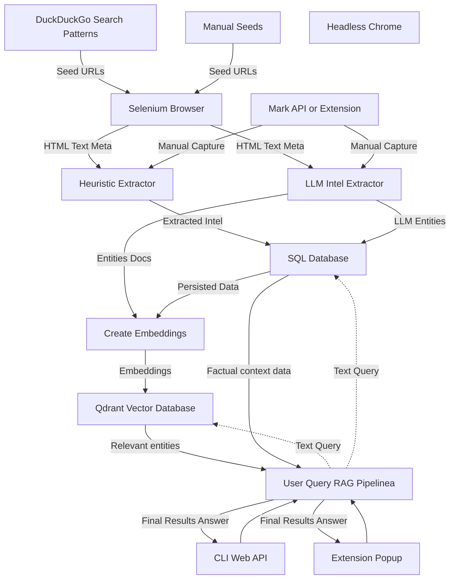

# Garuda: Entity-Aware Web Intelligence Crawler

[](LICENSE)

<!-- Uncomment and update the following badges if you add CI or coverage configs
[](https://github.com/anorien90/Garuda/actions)
[](https://codecov.io/gh/anorien90/Garuda)
-->

Garuda is a modular, entity-focused intelligence crawler leveraging LLMs, heuristic extraction, and hybrid search. It offers a web UI, API, and Chrome extension for streamlined open source investigations and research.

---

## Table of Contents

- [Key Features](#key-features)
- [New in v2.x / Refactored](#new-in-v2x--refactored)
- [Architecture Overview](#architecture-overview)
- [Requirements](#requirements)
- [Installation](#installation)
- [Configuration](#configuration)
- [Quickstart](#quickstart)
- [Screenshots](#screenshots)
- [Example Use Cases](#example-use-cases)
- [Demo Data & Public Datasets](#demo-data--public-datasets)
- [Contributing](#contributing)
- [Bug Reporting & Help](#bug-reporting--help)
- [Security Notes](#security-notes)
- [Roadmap](#roadmap)

---

## Key Features

- **Web UI**: Modern Flask-based search, statistics, and API endpoints (`/api/intel`, `/api/intel/semantic`, `/api/status`).
- **Chrome Extension**: Record pages/elements/images directly in-browser, with fast search, preview, and session handling.
- **Multi-layer Extraction**: HTML, metadata, images, fingerprints + LLM-powered intel with reflection/verification.
- **Structured Storage**: SQLAlchemy models and Qdrant vector search integration, with flexible config.
- **Conversational & Semantic Search**: RAG-style CLI & web chat across database and vectors.
- **Modular & Extensible**: Python modules organized for easy development and customization.
- **Strong Security**: API-key protected endpoints, CORS restrictors, and local LLM/vector options.

---

## New in v2.x / Refactored

- 🖥️ **Modern Flask Web App** in [`src/webapp/`](src/webapp): Quick access to search, status, and semantic endpoints.
- 🧩 **Improved Chrome Extension** in [`plugin/chrome/`](plugin/chrome): Multi-tab popup, session-aware marking, Tailwind-powered layout, settings persistence.
- 📦 **Configurable settings** via `.env` and `src/webapp/config.py`.
- 🦾 **Cleaner repo structure**: All modules isolated under `src/`, for browser, extractor, vector, database, etc.
- ⚡ **Enhanced extensibility**: Add new storage, LLM/vector backends, and UI components with ease.
- ✨ **UI improvements**: Extension features tabbed nav (Record, Search, View, Settings).

---

## Architecture Overview



- **WebApp**: [`src/webapp/app.py`](src/webapp/app.py)
- **Database**: [`src/database/`](src/database/)
- **Search CLI**: [`src/search.py`](src/search.py)
- **Extension**: [`plugin/chrome/`](plugin/chrome/)

---

## Requirements

- Python 3.10+
- Chrome/Chromium & chromedriver (for crawling)
- (Optional) [Qdrant](https://qdrant.tech/) for vector search
- (Optional) [Ollama](https://ollama.ai/) or OpenAI-compatible backend
- (Optional) `pytest`, `ruff`, `mypy` for development

---

## Installation

```bash
git clone https://github.com/anorien90/Garuda.git
cd Garuda
python -m venv .venv && source .venv/bin/activate
pip install -r requirements.txt
```

---

## Configuration

Configure via `.env` (see included sample) or environment variables. Main entries:

```env
GARUDA_DB_URL=sqlite:///crawler.db
GARUDA_OLLAMA_URL=http://localhost:11434/api/generate
GARUDA_OLLAMA_MODEL=granite3.1-dense:8b
GARUDA_QDRANT_URL=http://localhost:6333
GARUDA_QDRANT_COLLECTION=pages
GARUDA_UI_API_KEY=changeme
GARUDA_UI_CORS_ORIGINS=*
```

---

## Quickstart

**1. Start the Web UI:**
```bash
python -m src.webapp.app
```
Web UI available at `http://localhost:5000` (default).

**2. Run a crawl:**
```bash
python -m src.search run --sqlite-path crawler.db --qdrant-url http://localhost:6333 --model granite3.1-dense:8b --verbose
```

**3. Query intel via Web UI, CLI, or Extension.**

**4. Use the Chrome Extension:**
- Load `plugin/chrome/` as an unpacked extension in Chrome.
- Go to the extension, set your API endpoint and key in "Settings".
- Use "Record", "Search", and "View" tabs to interact!

---

## Screenshots

<!--
Paste your screenshots in a `screenshots/` folder and reference them here.
-->
**Web UI:**  


**Extension - Record:**  


**Extension - Search:**  


---

## Example Use Cases

- **Corporate OSINT**: Gather, structure, and search company leadership and product info.
- **Brand Monitoring**: Find, tag, and cluster factual and reputational mentions.
- **Threat Intelligence**: Explore and extract intelligence on infrastructure, actors, & TTPs from public data.
- **Academic Research**: Build entity datasets and knowledge graphs from news, orgs, science, and more.

---

## Demo Data & Public Datasets

- Example Datasets:  
  - [Sample Intel Export](https://github.com/anorien90/Garuda/releases/download/demo/intel_sample.json)
  - [Demo Crawl Output](https://github.com/anorien90/Garuda/releases/download/demo/demo_crawl.db)
- Have a public crawl/dataset link? [Let us know](#bug-reporting--help)!

---

## Contributing

Contributions are very welcome—bugfixes, doc improvements, and new features!  
To start:
- Fork & PR, or file an issue.
- Code must pass tests (`pytest`), linters (`ruff`, `black`), and typing (`mypy`).
- See [`CONTRIBUTING.md`](CONTRIBUTING.md) if present for guidelines.

---

## Bug Reporting & Help

- **Issues**: [File a GitHub issue](https://github.com/anorien90/Garuda/issues)
- **Email**: <h.lorenzen@nxs.solutions>
- **Discussions**: (Planned)  
Please provide logs, error messages, and details for faster help!

---

## Security Notes

- All API endpoints protected via API Key (set in env/config).
- Restrict CORS origins in production.
- LLM prompts may leak sensitive/confidential data—run locally if feasible.
- Headless browser can execute JS—use domain allowlists or sandboxing methods.

---

## Roadmap

- Enhanced user/account system for multi-user UI
- Prebuilt Docker & demo compose setup
- More advanced extractor fingerprints
- Support for additional vector/LLM providers
- Live crawl status dashboard in UI
- Export & report modules

---

**License:** GPL-3.0 © [anorien90](https://github.com/anorien90)

<!--
Links:
[View all code and UI files in anorien90/Garuda](https://github.com/anorien90/Garuda)
-->
