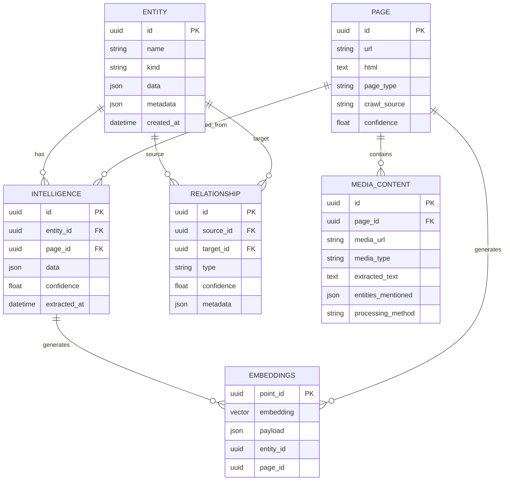

# Garuda: Entity-Aware Web Intelligence Crawler

[](LICENSE)


<!-- Uncomment and update the following badges if you add CI or coverage configs
[](https://github.com/anorien90/Garuda/actions)
[](https://codecov.io/gh/anorien90/Garuda)
-->

## Overview

**Garuda** is an advanced, entity-focused intelligence gathering and analysis platform that combines **web crawling**, **LLM-powered extraction**, **semantic search**, and **adaptive learning** to build comprehensive knowledge graphs. Named after the mythical eagle with omniscient vision, Garuda provides deep insights into entities (companies, people, organizations, products) through intelligent, gap-aware data collection.

### What Makes Garuda Different?

🧠 **Intelligent & Adaptive**: Unlike traditional crawlers, Garuda analyzes what it already knows and automatically fills knowledge gaps through targeted searches.

🔍 **RAG-First Hybrid Search**: Combines SQL keyword search with semantic vector search, automatically triggering live crawls when needed.

🕸️ **Knowledge Graph**: Tracks entities, relationships, and temporal changes in a unified graph structure with full provenance.

🎬 **Multi-Modal Processing**: Extracts intelligence from text, images (OCR), videos (transcription), and audio files.

🔧 **Production-Ready**: Web UI, REST API, and Chrome extension for flexible integration into existing workflows.

### Primary Use Cases

- **Open Source Intelligence (OSINT)**: Gather structured intelligence on companies, individuals, infrastructure
- **Corporate Research**: Build entity profiles with automated gap analysis and competitive intelligence
- **Threat Intelligence**: Track actors, infrastructure, tactics from public sources
- **Academic Research**: Create domain-specific knowledge graphs from scholarly and news sources
- **Brand Monitoring**: Monitor mentions, sentiment, and relationships across the web

---

## Table of Contents

- [Key Features](#key-features)
- [New in v2.x / Refactored](#new-in-v2x--refactored)
- [Architecture Overview](#architecture-overview)
- [Requirements](#requirements)
- [Installation](#installation)
- [Configuration](#configuration)
- [Quickstart](#quickstart)
- [Screenshots](#screenshots)
- [Example Use Cases](#example-use-cases)
- [Demo Data & Public Datasets](#demo-data--public-datasets)
- [Contributing](#contributing)
- [Bug Reporting & Help](#bug-reporting--help)
- [Security Notes](#security-notes)
- [Roadmap](#roadmap)

---

## Key Features

- **Unified Web UI**: Modern Flask-based interface with reorganized tabs for better usability:
  - 🔍 **Search**: Unified intel search (SQL + semantic vector search)
  - 🌐 **Crawler**: Intelligent web crawling with entity-awareness  
  - 📄 **Data**: Browse pages and recorded content
  - 🕸️ **Graph**: Interactive entity relationship visualization with unique entities
  - ✨ **Quality**: Entity gap analysis, deduplication, and data quality tools
  - 🎬 **Media**: Media processing (images, video, audio to text)
- **Chrome Extension**: Record pages/elements/images directly in-browser, with fast search, preview, and session handling.
- **Multi-layer Extraction**: HTML, metadata, images, fingerprints + LLM-powered intel with reflection/verification.
- **Structured Storage**: SQLAlchemy models and Qdrant vector search integration, with flexible config.
- **Conversational & Semantic Search**: RAG-style CLI & web chat across database and vectors.
- **Modular & Extensible**: Python modules organized for easy development and customization.
- **Strong Security**: API-key protected endpoints, CORS restrictors, and local LLM/vector options.
- **🧠 Intelligent Gap-Aware Crawling**: Automatically analyzes entity data, identifies missing fields, and generates targeted crawl strategies.
- **🎯 Entity Gap Analysis**: Identifies missing data fields with completeness scoring and prioritized recommendations.
- **📊 Adaptive Learning System**: Learns from crawl results to improve future discovery strategies.
- **🎬 NEW: Advanced Media Processing**: 
  - Extract text from images using Tesseract OCR or AI Image2Text models
  - Extract text from videos using audio transcription or AI Video2Text models
  - Extract audio from videos for separate processing
  - Speech-to-text for audio files
  - Multiple processing backends with configurable methods
  - Convert media into embeddings integrated into the knowledge graph
- **🕸️ NEW: Complete Relationship Persistence**: 
  - Ensures ALL entity relationships are persisted, even for multi-level hierarchies
  - Auto-creates missing entities referenced in relationships
  - Tracks full relationship chains: Seed → Page → Intel → Entities
  - Smart deduplication that preserves mandatory relationships
- **🕸️ NEW: Unique Entity Graph**: Entities graph ensures only unique entities with full relations and aggregated details.
- **🔄 NEW: Dynamic Entity Kind Registry**: 
  - Supports entity kind inheritance (CEO → Person, Headquarters → Location)
  - Runtime registration of new entity kinds discovered during extraction
  - Automatic kind normalization with alias support
  - Priority-based deduplication when multiple kinds apply
- **👥 NEW: Related Entity Extraction**: 
  - Extracts ALL entities mentioned on a page, not just the primary target
  - Automatically creates relationships between primary target and related entities
  - Detects specialized types (executives, headquarters) with parent type inheritance
- **🔁 NEW: Configurable Chat Search Cycles**: 
  - Multiple search/crawl cycles (default 3) for comprehensive answers
  - Full pipeline execution per cycle (crawl → extract → embed → RAG query)
  - Early termination when sufficient high-quality results found
  - Different search angles per cycle for broader coverage
- **🤖 NEW: Intelligent Agent Mode**: 
  - **Reflect & Refine**: Merge duplicate entities (Microsoft Corp → Microsoft Corporation), validate data quality
  - **Explore & Prioritize**: Analyze entity graphs, find high-priority entities based on relation depth
  - **Multidimensional RAG Search**: Combine embedding search with graph traversal for comprehensive results
  - Async chat with agent capabilities for streaming responses
  - CLI tool (`garuda-agent`) for command-line agent operations
- **⏱️ NEW: Extended LLM Timeouts**: 
  - Default timeouts increased to 15 minutes for long-running summarization
  - Configurable via environment variables
  - Hierarchical summarization for large texts that exceed context windows

---

## New in v2.x / Refactored

- 🖥️ **Reorganized Web UI** in [`src/webapp/`](src/webapp): Simplified tab structure grouping related functionality.
- 🎬 **Media Processing** in [`src/services/media_processor.py`](src/services/media_processor.py): Optional OCR, speech-to-text, and embedding generation.
- 🔗 **Unique Entity Graph**: Graph visualization uses canonical entity names and UUID-based deduplication for data quality.
- 🧩 **Improved Chrome Extension** in [`plugin/chrome/`](plugin/chrome): Multi-tab popup, session-aware marking, Tailwind-powered layout, settings persistence.
- 📦 **Configurable settings** via `.env` and `src/webapp/config.py`.
- 🦾 **Cleaner repo structure**: All modules isolated under `src/`, for browser, extractor, vector, database, etc.
- ⚡ **Enhanced extensibility**: Add new storage, LLM/vector backends, and UI components with ease.
- 🧠 **Dynamic Intelligence Gathering**: Gap-aware crawling, cross-entity inference, and adaptive strategies.
- 🔄 **Dynamic Entity Kind System**: Entity kinds with inheritance, automatic registration, and type hierarchy.
- 🔁 **Multi-cycle Chat Pipeline**: Configurable search cycles with full pipeline execution.
- 🤖 **Agent Mode**: Intelligent agent for data exploration, entity merging, and multidimensional search.

---

## Architecture Overview

### High-Level System Architecture

Garuda is built on a **modular, layered architecture** that separates concerns across data acquisition, processing, storage, and presentation layers. The system leverages hybrid search (SQL + vector embeddings), LLM-powered intelligence extraction, and adaptive learning to provide comprehensive entity intelligence gathering.

```mermaid
flowchart TB
    subgraph Presentation["🎨 Presentation Layer"]
        UI[Web UI - Flask]
        API[REST API]
        EXT[Chrome Extension]
    end
    
    subgraph Services["🔧 Services Layer"]
        GapAnalyzer[Entity Gap Analyzer]
        AdaptiveCrawler[Adaptive Crawler]
        MediaProcessor[Media Processor]
        InferenceEngine[Knowledge Inference]
    end
    
    subgraph Business["💼 Business Logic Layer"]
        Crawler[Intelligent Crawler]
        Extractor[Intel Extractor]
        Search[Hybrid Search]
        RelationMgr[Relationship Manager]
    end
    
    subgraph Data["💾 Data Layer"]
        SQL[(SQL Database<br/>SQLAlchemy)]
        Vector[(Vector Store<br/>Qdrant)]
        Cache[(Cache<br/>Redis/Memory)]
    end
    
    subgraph Infrastructure["⚙️ Infrastructure Layer"]
        Browser[Selenium Browser]
        LLM[LLM API<br/>Ollama/OpenAI]
        Embedding[Embedding Model<br/>SentenceTransformers]
    end
    
    UI --> API
    EXT --> API
    API --> Services
    Services --> Business
    Business --> Data
    Business --> Infrastructure
    Infrastructure --> Data
```



### Detailed Component Architecture

```mermaid
flowchart TD
    subgraph Input["📥 Data Input Sources"]
        DDG[DuckDuckGo<br/>Search]
        Manual[Manual<br/>Seeds]
        Extension[Chrome<br/>Extension]
        API_In[API<br/>Endpoints]
    end
    
    subgraph Acquisition["🌐 Data Acquisition"]
        Browser[Selenium<br/>Browser]
        Parser[BeautifulSoup<br/>Parser]
        MediaDown[Media<br/>Downloader]
    end
    
    subgraph Processing["⚙️ Processing Pipeline"]
        TextProc[Text<br/>Processor]
        IntelExt[LLM Intel<br/>Extractor]
        MediaProc[Media<br/>Processor]
        EntityDedupe[Entity<br/>Deduplication]
    end
    
    subgraph Storage["💾 Storage Layer"]
        SQLStore[(SQL DB<br/>Entities, Intel,<br/>Pages, Relations)]
        VectorStore[(Vector DB<br/>Embeddings)]
        MediaStore[(Media<br/>Content)]
    end
    
    subgraph Intelligence["🧠 Intelligence Layer"]
        GapAnalysis[Gap<br/>Analysis]
        Inference[Cross-Entity<br/>Inference]
        Learning[Adaptive<br/>Learning]
        PostProc[Post-Crawl<br/>Processing]
    end
    
    subgraph Query["🔍 Query & Retrieval"]
        HybridSearch[Hybrid Search<br/>SQL + Vector]
        RAG[RAG Pipeline]
        GraphQuery[Graph<br/>Queries]
    end
    
    subgraph Output["📤 Output & Visualization"]
        WebUI[Web UI<br/>6 Tabs]
        ExtUI[Extension<br/>Popup]
        APIOut[REST API<br/>Responses]
    end
    
    Input --> Acquisition
    Acquisition --> Processing
    Processing --> Storage
    Storage --> Intelligence
    Intelligence --> Query
    Query --> Output
    
    Intelligence -.->|Targeted Queries| Input
    Query -.->|Trigger Crawl| Acquisition
    
    style Input fill:#e1f5ff
    style Acquisition fill:#fff4e1
    style Processing fill:#ffe1e1
    style Storage fill:#e1ffe1
    style Intelligence fill:#f0e1ff
    style Query fill:#ffe1f5
    style Output fill:#e1f5ff
```



### Intelligent Crawling Workflow

```mermaid
flowchart TB
    Start([User Query:<br/>Entity Name]) --> Check{Entity<br/>Exists?}
    
    Check -->|No| Discovery[🔍 DISCOVERY Mode]
    Check -->|Yes| GapCheck[📊 Analyze Gaps]
    
    Discovery --> GenBroad[Generate<br/>Broad Queries]
    GenBroad --> Search[DuckDuckGo<br/>Search]
    
    GapCheck --> CalcScore[Calculate<br/>Completeness Score]
    CalcScore --> Missing[Identify<br/>Missing Fields]
    Missing --> GenTarget[Generate<br/>Targeted Queries]
    GenTarget --> Search
    
    Search --> Fetch[Selenium<br/>Browser Fetch]
    Fetch --> Extract[Multi-layer<br/>Extraction]
    
    Extract --> LLM[LLM Intel<br/>Extraction]
    Extract --> Heuristic[Heuristic<br/>Extraction]
    Extract --> Media[Media<br/>Processing]
    
    LLM --> Combine[Combine &<br/>Deduplicate]
    Heuristic --> Combine
    Media --> Combine
    
    Combine --> Store[Store to<br/>SQL + Vector]
    Store --> PostProc[Post-Crawl<br/>Processing]
    
    PostProc --> Dedupe[Entity<br/>Deduplication]
    PostProc --> RelVal[Relationship<br/>Validation]
    PostProc --> Aggregate[Intelligence<br/>Aggregation]
    PostProc --> InferMissing[Cross-Entity<br/>Inference]
    PostProc --> Embeddings[Embedding<br/>Generation]
    
    Embeddings --> Learn[Learning<br/>System Update]
    Learn --> Report[Report<br/>Results]
    
    Report --> ReCheck{Gaps<br/>Filled?}
    ReCheck -->|No & Iterations < Max| GenTarget
    ReCheck -->|Yes| Complete([Complete])
    
    style Start fill:#4CAF50,color:#fff
    style Complete fill:#4CAF50,color:#fff
    style Discovery fill:#2196F3,color:#fff
    style GapCheck fill:#FF9800,color:#fff
```



### RAG-First Hybrid Search Flow

```mermaid
sequenceDiagram
    participant U as User
    participant UI as Web UI
    participant API as Search API
    participant V as Vector Store
    participant S as SQL Store
    participant L as LLM
    participant C as Crawler
    
    U->>UI: Ask Question
    UI->>API: POST /api/chat
    
    API->>API: Embed Query
    API->>V: Semantic Search (top_k)
    V-->>API: RAG Results (with scores)
    
    API->>API: Filter High Quality<br/>(score >= 0.7)
    
    alt High Quality RAG Results >= 2
        API->>S: Supplement with SQL
        S-->>API: Keyword Results
        API->>API: Merge & Rank
    else Insufficient RAG Results
        API->>L: Generate Search Queries
        L-->>API: Targeted Queries
        API->>C: Trigger Intelligent Crawl
        C->>C: Fetch → Extract → Store → Embed
        C-->>API: New Data Available
        API->>V: Re-query Vector Store
        V-->>API: Enhanced RAG Results
    end
    
    API->>L: Synthesize Answer<br/>from Context
    L-->>API: Generated Answer
    
    API-->>UI: Answer + Context<br/>+ Metadata
    UI-->>U: Display Results<br/>with Source Tags
    
    Note over U,C: 🧠 Purple: RAG | 📊 Blue: SQL | 🌐 Green: Live Crawl
```



### Data Model & Relationships



### Module Organization

```
src/garuda_intel/
├── 🌐 browser/          # Web scraping & automation
│   ├── selenium.py      # Headless Chrome driver
│   └── active.py        # Interactive browser sessions
│
├── 💾 database/         # Data persistence & ORM
│   ├── models.py        # SQLAlchemy entities
│   ├── engine.py        # Database operations
│   ├── store.py         # Abstraction layer
│   └── relationship_manager.py  # Graph operations
│
├── 🔍 discover/         # Intelligent crawling
│   ├── crawl_modes.py   # Discovery/Targeting/Expansion
│   ├── crawl_learner.py # Adaptive learning
│   └── seeds.py         # URL seed management
│
├── ⚙️ extractor/        # Intelligence extraction
│   ├── intel_extractor.py     # LLM-based extraction
│   ├── semantic_engine.py     # Embeddings generation
│   ├── text_processor.py      # Content cleaning
│   └── llm.py                 # LLM interface
│
├── 🧠 services/         # High-level business logic
│   ├── entity_gap_analyzer.py   # Gap detection
│   ├── adaptive_crawler.py      # Crawl orchestration
│   └── media_processor.py       # Media extraction
│
├── 🔢 vector/           # Vector database
│   ├── engine.py        # Qdrant integration
│   └── base.py          # Abstract interface
│
└── 🌐 webapp/           # Web UI & API
    ├── app.py           # Flask application
    ├── routes/          # API endpoints
    └── static/          # Frontend assets
```

---

### Key Technologies

| Component | Technology | Purpose |
|-----------|-----------|---------|
| **Backend** | Python 3.10+ | Core application |
| **Web Framework** | Flask | REST API & UI |
| **Database** | SQLAlchemy + SQLite/PostgreSQL | Structured data storage |
| **Vector DB** | Qdrant | Semantic search |
| **Browser** | Selenium + Chrome | Web scraping |
| **LLM** | Ollama / OpenAI API | Intelligence extraction |
| **Embeddings** | SentenceTransformers | Semantic representations |
| **Media** | Tesseract OCR, Speech Recognition | Media processing |
| **Frontend** | Vanilla JS, Tailwind CSS | User interface |

---

### Quick Navigation

- **WebApp**: [`src/garuda_intel/webapp/app.py`](src/garuda_intel/webapp/app.py)
- **Database Models**: [`src/garuda_intel/database/models.py`](src/garuda_intel/database/models.py)
- **Intelligent Crawler**: [`src/garuda_intel/discover/crawl_modes.py`](src/garuda_intel/discover/crawl_modes.py)
- **Intel Extraction**: [`src/garuda_intel/extractor/intel_extractor.py`](src/garuda_intel/extractor/intel_extractor.py)
- **Search API**: [`src/garuda_intel/webapp/routes/search.py`](src/garuda_intel/webapp/routes/search.py)
- **Chrome Extension**: [`plugin/chrome/`](plugin/chrome/)
- **V2 Optimization Plan**: [`V2_OPTIMIZATION_PLAN.md`](V2_OPTIMIZATION_PLAN.md)

---

## How It Works

### Core Workflows

#### 1. Intelligent Entity Discovery

When you search for an entity (e.g., "Microsoft"), Garuda:

1. **Checks Existing Knowledge**: Queries the database to see if the entity exists
2. **Analyzes Gaps**: If entity exists, calculates completeness score (0-100%) and identifies missing critical fields
3. **Generates Queries**: Uses LLM to create targeted search queries based on gaps
4. **Crawls Smart**: Fetches relevant pages using Selenium, prioritizing high-authority domains
5. **Extracts Intelligence**: Multi-layer extraction (heuristics + LLM) to identify facts, relationships, entities
6. **Learns & Adapts**: Tracks which sources provided valuable data, improving future crawls

#### 2. RAG-First Hybrid Search

When you ask a question:

1. **Semantic Search First**: Embeds your question and searches vector store (Qdrant) for semantically similar content
2. **Quality Filtering**: Only uses high-quality RAG results (similarity score >= 0.7)
3. **SQL Supplement**: Adds keyword-based SQL search results to fill gaps
4. **Auto-Crawl Trigger**: If insufficient high-quality results, automatically triggers targeted web crawl
5. **Synthesis**: LLM combines context from multiple sources to generate comprehensive answer
6. **Source Attribution**: Every fact traced back to source URL with confidence scores

#### 3. Knowledge Graph Construction

As data is gathered:

1. **Entity Extraction**: LLM identifies entities (people, companies, locations, products)
2. **Relationship Detection**: Discovers relationships (works_at, owns, located_in, etc.)
3. **Deduplication**: Merges duplicate entities using fuzzy matching + embeddings
4. **Graph Building**: Creates bidirectional relationships with confidence scores
5. **Inference**: Cross-entity reasoning to fill gaps (e.g., if Person works_at Company in City, infer Person likely in City)
6. **Visualization**: Interactive graph UI showing entity network

#### 4. Media Intelligence

When processing web pages:

1. **Auto-Detection**: Identifies images with text, videos with speech, audio files
2. **Method Selection**: Chooses optimal processing (Tesseract for printed text, AI for handwriting)
3. **Text Extraction**: OCR for images, speech-to-text for audio/video
4. **Entity Linking**: Connects extracted media text to relevant entities
5. **Embedding Integration**: Media content becomes searchable in knowledge graph

### Data Flow Example

```
User Query: "What is Acme Corp's headquarters?"
    ↓
[1] Check Database → Entity "Acme Corp" exists, completeness: 45%
    Missing: headquarters, founding_year, CEO
    ↓
[2] Gap Analysis → Generate targeted query: "Acme Corp headquarters address"
    ↓
[3] DuckDuckGo Search → Find 5 candidate URLs
    ↓
[4] Selenium Crawl → Fetch pages in parallel
    ↓
[5] LLM Extraction → Extract: {"headquarters": "123 Main St, SF, CA"}
    ↓
[6] Store Intelligence → Save to SQL + generate embedding → store in Qdrant
    ↓
[7] Learning Update → Mark source as "reliable for company data"
    ↓
[8] Return Answer → "Acme Corp headquarters: 123 Main St, SF, CA" 
    (Source: acmecorp.com, Confidence: 0.92)
```

---

## Requirements

- Python 3.10+
- Chrome/Chromium & chromedriver (for crawling)
- (Optional) [Qdrant](https://qdrant.tech/) for vector search
- (Optional) [Ollama](https://ollama.ai/) or OpenAI-compatible backend
- (Optional) `pytest`, `ruff`, `mypy` for development

---

## Installation

```bash
git clone https://github.com/anorien90/Garuda.git
cd Garuda
python -m venv .venv && source .venv/bin/activate
pip install -r requirements.txt
```

---

## Configuration

Configure via `.env` (see included sample) or environment variables. Main entries:

```env
# Core settings
GARUDA_DB_URL=sqlite:///crawler.db
GARUDA_OLLAMA_URL=http://localhost:11434/api/generate
GARUDA_OLLAMA_MODEL=granite3.1-dense:8b
GARUDA_QDRANT_URL=http://localhost:6333
GARUDA_QDRANT_COLLECTION=pages
GARUDA_UI_API_KEY=changeme
GARUDA_UI_CORS_ORIGINS=*

# Media processing (optional feature)
GARUDA_MEDIA_PROCESSING=true     # Enable media text extraction
GARUDA_MEDIA_CRAWLING=true       # Automatically extract media from pages
GARUDA_MEDIA_EMBEDDINGS=true     # Generate embeddings from media text

# Media processing methods (new in v2.1)
GARUDA_MEDIA_IMAGE_METHOD=tesseract    # Image: "tesseract" (OCR) or "image2text" (AI model)
GARUDA_MEDIA_VIDEO_METHOD=speech       # Video: "speech" (audio) or "video2text" (AI model)
GARUDA_MEDIA_AUDIO_METHOD=speech       # Audio: "speech" (speech recognition)

# Chat pipeline settings (new in v2.2)
GARUDA_CHAT_MAX_SEARCH_CYCLES=3        # Max search/crawl cycles for chat (default: 3)
GARUDA_CHAT_MAX_PAGES=5                # Max pages per cycle (default: 5)
GARUDA_CHAT_RAG_QUALITY_THRESHOLD=0.7  # Min RAG similarity score (default: 0.7)
GARUDA_CHAT_USE_SELENIUM=false         # Use Selenium for chat crawling
GARUDA_CHAT_EXTRACT_RELATED_ENTITIES=true  # Extract related entities during crawl

# LLM timeout settings (new in v2.3) - longer timeouts for reliability
GARUDA_LLM_SUMMARIZE_TIMEOUT=900       # 15 minutes default for summarization
GARUDA_LLM_EXTRACT_TIMEOUT=900         # 15 minutes default for extraction
GARUDA_LLM_REFLECT_TIMEOUT=300         # 5 minutes default for reflection
GARUDA_LLM_SUMMARIZE_RETRIES=3         # Number of retry attempts

# Agent mode settings (new in v2.3)
GARUDA_AGENT_ENABLED=true              # Enable agent mode
GARUDA_AGENT_MAX_EXPLORATION_DEPTH=3   # Max relation depth for exploration
GARUDA_AGENT_ENTITY_MERGE_THRESHOLD=0.85  # Similarity threshold for merging
```

---

## Quickstart

**1. Start the Web UI:**
```bash
python -m src.webapp.app
```
Web UI available at `http://localhost:5000` (default).

**2. Run a crawl:**
```bash
python -m src.search run --sqlite-path crawler.db --qdrant-url http://localhost:6333 --model granite3.1-dense:8b --verbose
```

**3. Try the NEW Intelligent Crawl:**

Garuda now features three crawl modes for maximum flexibility:

**a) 🧠 Intelligent Crawl (Recommended for most use cases)**
- Open the Web UI at `http://localhost:5000`
- Go to the "Crawler" tab
- Find the "🧠 Intelligent Crawl" section (blue box at top)
- Enter an entity name like "Bill Gates" or "Microsoft"
- Optionally select entity type (or leave as auto-detect)
- Click "🚀 Start Intelligent Crawl"
- The system will automatically:
  - Check if the entity exists in database
  - Analyze existing data and identify gaps (gap-filling mode)
  - OR generate comprehensive discovery queries (discovery mode)
  - Execute targeted crawl with adaptive strategy
  - Show completeness scores, gaps filled, and learning stats

**b) 🎯 Smart Crawl (Auto-Detection)**
- Scroll to "Advanced Crawl Options" section
- Enter entity name in the "Entity" field
- Configure crawl parameters if desired (or use defaults)
- Click "🎯 Smart Crawl (Auto-detect)" button
- System automatically selects intelligent mode if entity exists, standard mode if new
- Best for: "I don't know if this entity exists yet"

**c) 🔧 Advanced Crawl (Full Control)**
- Use the standard "Advanced Crawl" button for complete parameter control
- Supports seed URLs, Selenium, active browsing mode, etc.
- Best for: Specific domains, debugging, specialized research

**4. Analyze Entity Gaps:**
- Go to the "Entity Tools" tab
- Click "📊 Analyze All (Top 20)" to see entities with the most data gaps
- Or enter a specific entity UUID and click "🔍 Analyze Gaps"
- View completeness scores, missing fields, and suggested sources
- Click "Fill Gaps with Targeted Crawl" to immediately launch gap-filling

**5. Query intel via Web UI, CLI, or Extension.**

**6. Use the Chrome Extension:**
- Load `plugin/chrome/` as an unpacked extension in Chrome.
- Go to the extension, set your API endpoint and key in "Settings".
- Use "Record", "Search", and "View" tabs to interact!

**For detailed information about intelligent crawling features, workflows, and API reference, see [FEATURES.md](FEATURES.md).**

---

## Screenshots

<!--
Paste your screenshots in a `screenshots/` folder and reference them here.
-->
**Web UI:**  


**Extension - Record:**  


**Extension - Search:**  


---

## Example Use Cases

- **Corporate OSINT**: Gather, structure, and search company leadership and product info.
- **Brand Monitoring**: Find, tag, and cluster factual and reputational mentions.
- **Threat Intelligence**: Explore and extract intelligence on infrastructure, actors, & TTPs from public data.
- **Academic Research**: Build entity datasets and knowledge graphs from news, orgs, science, and more.

---

## Demo Data & Public Datasets

- Example Datasets:  
  - [Sample Intel Export](https://github.com/anorien90/Garuda/releases/download/demo/intel_sample.json)
  - [Demo Crawl Output](https://github.com/anorien90/Garuda/releases/download/demo/demo_crawl.db)
- Have a public crawl/dataset link? [Let us know](#bug-reporting--help)!

---

## Contributing

Contributions are very welcome—bugfixes, doc improvements, and new features!  
To start:
- Fork & PR, or file an issue.
- Code must pass tests (`pytest`), linters (`ruff`, `black`), and typing (`mypy`).
- See [`CONTRIBUTING.md`](CONTRIBUTING.md) if present for guidelines.

---

## Bug Reporting & Help

- **Issues**: [File a GitHub issue](https://github.com/anorien90/Garuda/issues)
- **Email**: <h.lorenzen@nxs.solutions>
- **Discussions**: (Planned)  
Please provide logs, error messages, and details for faster help!

---

## Security Notes

- All API endpoints protected via API Key (set in env/config).
- Restrict CORS origins in production.
- LLM prompts may leak sensitive/confidential data—run locally if feasible.
- Headless browser can execute JS—use domain allowlists or sandboxing methods.

---

## Roadmap

### Current Status (v2.x)
✅ Intelligent gap-aware crawling with adaptive learning  
✅ RAG-first hybrid search (SQL + vector)  
✅ Complete relationship persistence and entity deduplication  
✅ Advanced media processing (OCR, speech-to-text, video processing)  
✅ Chrome extension with recording and search capabilities  
✅ Web UI with 6 specialized tabs  

### Planned Enhancements (v2.1+)

**See [V2_OPTIMIZATION_PLAN.md](V2_OPTIMIZATION_PLAN.md) for the comprehensive optimization roadmap.**

#### Phase 1: Quick Wins (Weeks 1-2)
- [ ] Multi-layer caching (embeddings, LLM responses, search results)
- [ ] Content type detection and specialized processors
- [ ] Automatic media detection (no manual configuration)
- [ ] Database query optimization and indexing

#### Phase 2: Core Enhancements (Weeks 3-5)
- [ ] Dynamic schema discovery (adapt to any entity type)
- [ ] Adaptive media processing (auto-select best method)
- [ ] Semantic text chunking (preserve context)
- [ ] Extraction quality validation and auto-correction
- [ ] Comprehensive test suite (80%+ coverage)

#### Phase 3: Advanced Features (Weeks 6-8)
- [ ] Multi-source adapters (PDF, APIs, social media, databases)
- [ ] Knowledge inference engine (graph-based reasoning)
- [ ] Media-entity linking and searchability
- [ ] CI/CD pipeline with automated testing

#### Phase 4: Optimization (Weeks 9-10)
- [ ] Async crawling architecture (5-10x speed improvement)
- [ ] Multi-model embedding strategy (domain-specific models)
- [ ] Prometheus metrics and Grafana dashboards
- [ ] Automated data quality validation

#### Phase 5: Production Readiness (Weeks 11-12)
- [ ] Temporal intelligence tracking (version history)
- [ ] Asynchronous media processing queue
- [ ] Enhanced user/account system for multi-user deployments
- [ ] Export and report generation modules
- [ ] Prebuilt Docker compose setup with demo data

#### Future Considerations
- Support for additional vector/LLM providers (Weaviate, Pinecone, Claude)
- Advanced visualization dashboards (live crawl status, analytics)
- Collaborative features (shared knowledge bases, annotations)
- Mobile app for on-the-go intelligence gathering

---

**License:** GPL-3.0 © [anorien90](https://github.com/anorien90)

<!--
Links:
[View all code and UI files in anorien90/Garuda](https://github.com/anorien90/Garuda)
-->
